# band-maker-minisat

## Quickstart

```
git clone git@github.com:simonpicard/band-maker-minisat.git
cd band-maker-minisat
cmake src
make
./Question 1 test/example_0.txt res1.txt
./Question 2 test/example_1.txt res2.txt
./Question 3 test/example_1.txt res3.txt
```

Explore results in `res*.txt`.

## Goal

The goal of the basic computer science project is to form groups of music under certain constraints. It is about expressing the constraints in conjunctive normal form in order to encode them in the tool to solve the various given problems. For this, we use the * MiniSat * solver which allows to determine, under a set of constraints, if a problem is satisfactory.

# Question 1

## Definition of variables and symbols

In this section, we define the different variables and symbols that we use in the expression of constraints in conjunctive normal form.

- `M` is the number of musicians.
- `I` is the number of instruments.
- `K` is the maximum number of groups.
- `X`<sub>`a, b, c`</sub> is a variable such that for all musician `a`, the instrument `b` in the group `c`, `X`<sub>`a, b, c`</sub>` = true` if and only if the musician `a` plays the instrument `b` in the group `c`.
- `I`<sub>`a`</sub> represents the list of instruments that `a` masters.

### Input file fomat

```
M I K 
1 first_instrument [second_instrument third_isnsturment ... kth_intsrument]
2 first_instrument [second_instrument third_isnsturment ... kth_intsrument]
...
M first_instrument [second_instrument third_isnsturment ... kth_intsrument]
```

Example:
```
3 2 3
1 1
2 2 3
3 2 3
```

## Forme Normale Conjonctive

### Contrainte d’existence

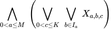

Il s’agit simplement de dire que chaque musicien doit jouer un des
instruments qu’il maitrise dans un groupe.

### Un musicien ne peut être que dans un seul groupe


Par musicien, nous disons qu’il ne peut pas, à la fois jouer d’un
instrument `b`<sub>`1`</sub> quelconque dans un groupe `c`<sub>`1`</sub> et
un instrument `b`<sub>`2`</sub> quelconque dans un autre groupe
`c`<sub>`2`</sub>.

### Un instrument par groupe

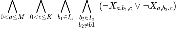

Par musicien, nous disons qu’il ne peut pas à la fois jouer d’un
instrument `b`<sub>`1`</sub> dans un groupe c et d’un autre instrument
`b`<sub>`2`</sub> quelconque dans le même groupe c.

### Un seul musicien peut jouer d’un certain instrument dans un groupe

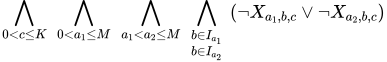

Nous exprimons ici que, dans un même groupe, une personne
`a`<sub>`1`</sub> et autre `a`<sub>`2`</sub> ne peuvent pas jouer du même
instrument dans un groupe.

### Tous les instruments dans un groupe ou aucun

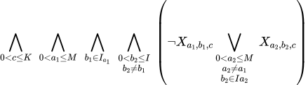

Ici nous voulons exprimer la contrainte groupe complet ou vide, pour ce
faire nous utilisons une implication qui dit que, dans chaque groupe, si
un musicien `a`<sub>`1`</sub> joue d’un instrument `b`<sub>`1`</sub>, alors
ceci implique que, pour chaque autre instrument `b`<sub>`2`</sub>, un des
autres musiciens maîtrisant ce dernier, `a`<sub>`2`</sub>, le joue dans ce
groupe.

# Question 2

## Définition des variables et symboles

-   `Max`<sub>`a`</sub> représente le nombre maximum de groupe dans
    lequel le musicien `a` peut jouer.

-   \|`I`<sub>`a`</sub>\| représente la cardinalité de `I`<sub>`a`</sub>
    soit le nombre d’instruments dont `a` peut se servir.

Les variables et symboles restants sont identiques à ceux de la question
1.

## Forme Normale Conjonctive

### Un musicien ne peut pas jouer dans plus de `Max`<sub>`a`</sub> groupes

Pour implémenter cela, nous allons étendre la solution "un groupe
maximum" qui, pour rappel, voulait exprimer
¬(`groupe`<sub>`1`</sub>∧`groupe`<sub>`2`</sub>) ∧ ¬(`groupe`<sub>`2`</sub>∧`groupe`<sub>`3`</sub>)…
Dans la conjonction se trouveront `Max`<sub>`a`</sub> + 1 littéraux.
Pour se faire, on commence par générer tous les sous-ensembles de groupe
de taille `Max`<sub>`a`</sub> + 1 et toutes les combinaisons de
`I`<sub>`a`</sub> de taille `Max`<sub>`a`</sub> + 1. Car un joueur
ne peut pas jouer d’un même instrument dans différents groupes ni de
différents instruments dans différents groupes.

A la seconde étape, on génère toutes les combinaisons d’identifiants
(`t` et `s`) et finalement, il ne reste qu’à choisir une des
combinaisons avec les variables `x` et `y`.

Cette contrainte est exprimée par la première ligne de la forme normale
conjonctive suivante. On peut illustrer cela par un exemple où `K` = 3
et `Max`<sub>`a`</sub> + 1 = 2  
  


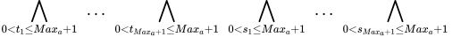

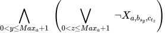

Nous nous rendons compte qu’avec cette contrainte, nous vérifions aussi
la contrainte *Un instrument par groupe* puisque parfois, pour tout `y`,
`s`<sub>`y`</sub> sera identique pour toute la clause, dès lors nous
n’avons plus besoin de cette contrainte.  
Pour le reste, les autres contraintes sont identiques.  
Le nombre de clauses crée sera égal à :  

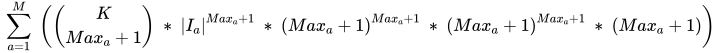

Soit  

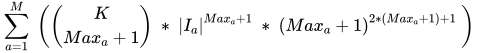

Sachant que chaque clause est composée des `Max`<sub>`a`</sub>
littéraux. Cependant, il y aura des doublons dans les clauses générées,
mais le solveur MiniSat se chargera de les supprimer pour nous[^1].

# Question 3

## Définition des variables

-   L’instrument qui a comme valeur `I` est toujours l’instrument
    *chant*.

Les variables et les symboles sont identiques à ceux de la question 2.

## Forme Normale Conjonctive

### Un seul musicien peut jouer d’un certain instrument dans un groupe

C’est toujours vrai sauf quand l’instrument considéré est le chant.

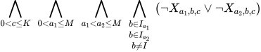

### Tous les instruments dans un groupe ou aucun

La contrainte reste vraie, cependant si un musicien utilise un autre
instrument que sa voix, ceci peut impliquer qu’il chante et inversement
(s’il maîtrise ces instruments bien surs).  

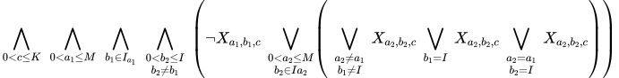

Dans la parenthèse la plus imbriquée, le premier grand ou est le même
que précédemment, le second signifie que, si `a`<sub>`1`</sub> chante,
alors `a`<sub>`2`</sub> peut chanter aussi et le dernière représente le
fait que si `a`<sub>`1`</sub> joue d’un instrument et qu’il sait chanter,
il peut faire les deux.

### Un instrument par groupe

La contrainte *Un instrument par groupe* et la contrainte *Un musicien
ne peut pas jouer dans plus de `Max`<sub>`a`</sub> groupes* ne
peuvent plus être combinées, puisque la première n’est plus toujours
vraie depuis l’arrivée de la composante du chant.  
Commençons par réintroduire cette dernière :

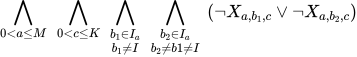

Il s’agit de la même expression que dans la première question sauf que
`b`<sub>`1`</sub> et `b`<sub>`2`</sub> ne peuvent pas valoir `I`, le
*chant*.

### Un musicien ne peut pas jouer dans plus de `Max`<sub>`a`</sub> groupes

Cette contrainte reste vraie, sauf pour l’instrument `I` et il ne faut
plus introduire en même temps la contrainte décrite ci-dessus. Voici la
forme normale conjonctive :  

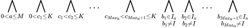

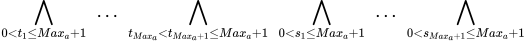


Ici, nous ne prenons plus tous les ensembles d’indices de `c`<sub>`t`</sub>
mais uniquement les ensembles différents, nous nous retrouvons alors
avec un coefficient binomial 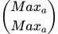 qui vaut 1, en
effet il s’agit simplement de la suite des indices ce qui nous donne
bien ce qu’on souhaite, chaque `c`<sub>`t`</sub> sera différent des
autres.

#### <span id="Addendum" label="Addendum">addendum</span>

Dans ce cas, les clauses générées auront pour but unique d’introduire
une contrainte *au plus k* et il y en aura :

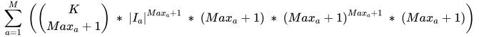

Soit  


Il est important de noter qu’on omettra l’instrument *chant* dans
l’ensemble `I`<sub>`a`</sub>.

[^1]: Addendum au nombre de clauses créé à la section
    <a href="#Addendum" data-reference-type="ref" data-reference="Addendum">Addendum</a>
