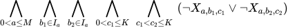
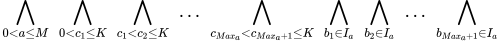
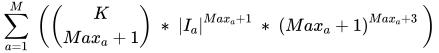

# band-maker-minisat

## Quickstart

```
git clone git@github.com:simonpicard/band-maker-minisat.git
cd band-maker-minisat
cmake src
make
./Question 1 test/example_0.txt res1.txt
./Question 2 test/example_1.txt res2.txt
./Question 3 test/example_1.txt res3.txt
```

Explore results in `res*.txt`.

## Goal

The goal of the basic computer science project is to form groups of music under certain constraints. It is about expressing the constraints in conjunctive normal form in order to encode them in the tool to solve the various given problems. For this, we use the * MiniSat * solver which allows to determine, under a set of constraints, if a problem is satisfactory.

# Question 1

## Definition of variables and symbols

In this section, we define the different variables and symbols that we use in the expression of constraints in conjunctive normal form.

- `M` is the number of musicians.
- `I` is the number of instruments.
- `K` is the maximum number of groups.
- `X`<sub>`a, b, c`</sub> is a variable such that for all musician `a`, the instrument `b` in the group `c`, `X`<sub>`a, b, c`</sub>` = true` if and only if the musician `a` plays the instrument `b` in the group `c`.
- `I`<sub>`a`</sub> represents the list of instruments that `a` masters.

### Input file fomat

```
M I K 
1 first_instrument [second_instrument third_isnsturment ... kth_intsrument]
2 first_instrument [second_instrument third_isnsturment ... kth_intsrument]
...
M first_instrument [second_instrument third_isnsturment ... kth_intsrument]
```

Example:
```
3 2 3
1 1
2 2 3
3 2 3
```

## Conjunctive Normal Form

### Existence constraint


It's just a matter of saying that every musician should play one of the
instruments he masters in a group.

### A musician can only be in one group



Each musician cannot, at the same time play a
any instrument `b` <sub>`1`</sub> in a group `c` <sub>`1`</sub> and
any other intrument `b`<sub>`2`</sub> in another group
`c`<sub>`2`</sub>.

### One instrument per group


Each musician cannot both play one
instrument `b`<sub>`1`</sub> in group `c` and another instrument
`b`<sub>`2`</sub> any in the same group `c`.

### Only one musician can play a certain instrument in a group


We express here that, in the same group, a person
`a`<sub>`1`</sub> and another person `a`<sub>`2`</sub> cannot both play the same
instrument in the given group.

### All instruments in a group or none


Here we want to express the constraint complete or empty group, to do this we use 
an implication that says that, in each group, if a musician
a musician `a`<sub>`1`</sub> plays an instrument `b`<sub>`1`</sub>, then
this implies that, for every other instrument `b`<sub>`2`</sub>, one of the other
musicians who master the latter, `a`<sub>`2`</sub>, plays it in this
group.

# Question 2

## Definition of variables and symbols

- `Max`<sub>`a`</sub> represents the maximum number of groups in which the musician `a` can play.

- `|I`<sub>`a`</sub>`|` represents the cardinality of `I`<sub>`a`</sub>
    which is the number of instruments `a` can play.

The remaining variables and symbols are identical to those in question
1.

## Conjunctive Normal Form

### A musician cannot play in more than `Max`<sub>`a`</sub> groups

To implement this, we will extend the "one group maximum" solution which, as a reminder, was expressing
¬(`group`<sub>`1`</sub>∧`group`<sub>`2`</sub>) ∧ ¬(`group`<sub>`2`</sub>∧`group`<sub>`3`</sub>)...
In the conjunction, there will be `Max`<sub>`a`</sub> + 1 literals.
To do this, we start by generating all group subsets of size `Max`<sub>`a`</sub>`+ 1` and all combinations of `I`<sub>`a`</sub> of size `Max`<sub>`a`</sub>` + 1`. Because a player cannot play the same instrument in different groups or different instruments in different groups.

In the second step, we generate all the combinations of identifiers (`t` and `s`) and finally, we only have to choose one of the combinations with the variables `x` and `y`.

This constraint is expressed by the first line of the following conjunctive normal form. This can be illustrated by an example where `K` = 3 and `Max`<sub>`a`</sub>` + 1 = 2`.
  



We realize that with this constraint, we also check the *One instrument per group* constraint since sometimes, for any `y`, `s`<sub>`y`</sub> will be the same for the whole clause, so we don't need this constraint anymore.
For the rest, the other constraints are identical.  
The number of clauses created will be equal to :  


I.e.  


Knowing that each clause is composed of `Max`<sub>`a`</sub> literals. However, there will be duplicates in the generated clauses, but the MiniSat solver will take care of removing them for us [^1].

# Question 3

## Definition of variables

- The instrument with value `I` is always the instrument *singing*.

The variables and symbols are the same as in question 2.

## Conjunctive Normal Form

### Only one musician can play a certain instrument in a group

This is always true except when the instrument considered is singing.


### All instruments in a group or none

The constraint remains true, however, if a musician uses another instrument than his voice, this can imply that he sings and vice versa (if he masters these instruments of course).  


In the most nested parenthesis, the first big or is the same as before, the second means that, if `a`<sub>`1`</sub> sings, then `a`<sub>`2`</sub> can sing too, and the last represents the fact that if `a`<sub>`1`</sub> plays an instrument and can sing, he can do both.

### One instrument per group

The constraint *One instrument per group* and the constraint *A musician cannot play in more than `Max`<sub>`a`</sub> groups* can no longer be combined, because the former is no longer always true since the arrival of the singing component. 

Let's start by reintroducing the latter:


This is the same expression as in the first question except that `b`<sub>`1`</sub> and `b`<sub>`2`</sub> cannot be `I`, the *singing*.

### A musician cannot play in more than `Max`<sub>`a`</sub> groups.

This constraint remains true, except for the instrument `I`, and the constraint described above should no longer be introduced at the same time. Here is the
forme normale conjonctive :  


Here we no longer take all sets of indices of `c`<sub>`t`</sub> but only the different sets, we then end up with a binomial coefficient  which is 1, indeed it is simply the sequence of indices which gives us what we want, each `c`<sub>`t`</sub> will be different from the others.

#### <span id="addendum" label="addendum">Addendum</span>

In this case, the generated clauses will have the sole purpose of introducing a *at most k* constraint and there will be :


Let  



It is important to note that we will omit the *singing* instrument in the `I`<sub>`a`</sub> set.

[^1]: addendum to the number of clauses created in the section
    <a href="#addendum" data-reference-type="ref" data-reference="addendum">Addendum</a>
